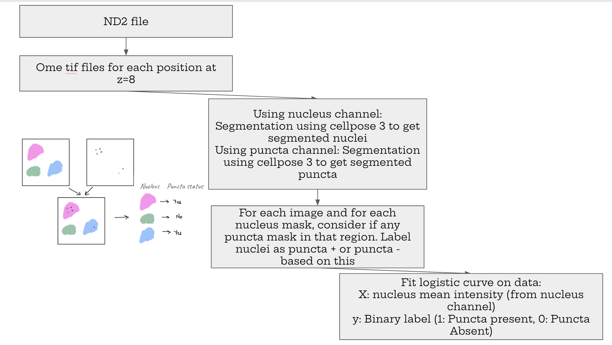

## End-to-end pipeline for segmentation and quantitative analysis of fluorescence microscopy data to study phase separation.
---

## Quickstart (TL;DR)

For a minimal, end-to-end example of how to run the pipeline, use the commands below:

```bash
# 1. Convert ND2 → OME-TIFF (z = 8)
cd nucleus/preprocessing/
python nd2_to_ome_tif.py

# 2. Generate masks
cd ../mask_creation/
python evaluate_nucleus.py --input /path/to/ome/tifs --outdir /path/to/nucleus_masks --gpu --diameter 200
python evaluate_puncta.py  --input /path/to/ome/tifs --outdir /path/to/puncta_masks  --gpu --diameter 20

# 3. Detect puncta per nucleus + aggregate data
cd ../puncta_detection/
python mean_intensity_and_puncta.py \
  --nuc-dir /path/to/nucleus_masks \
  --puncta-dir /path/to/puncta_masks \
  --intensity-dir /path/to/ome/tifs \
  --out-csv /path/to/output.csv \
  --make-triptychs \
  --triptych-out-dir /path/to/triptychs \
  --intensity-channel 2 \
  --puncta-channel 1
```

Then open `csat_estimation.ipynb`, set `CSV_PATH` to the generated CSV, and run the notebook to estimate **C_sat**.

---

## Repository structure

This repository is organized into two main folders:

- `nucleus/` – **primary focus of the current workflow**  
  Contains preprocessing, segmentation, puncta detection, and C_sat estimation scripts for nuclear analysis.

- `cytoplasm/` – *work in progress / older scripts*  
  This folder is currently not actively used. The latest and maintained pipeline lives under `nucleus/`.

---

## Overall workflow

This pipeline processes raw microscopy data to detect puncta formation and estimate phase separation behavior at differing protein concentrations.


**High-level steps:**
1. Convert ND2 files to OME-TIFFs (one image per position, fixed z-slice).
2. Segment nuclei and puncta using Cellpose.
3. Determine which nuclei contain puncta.
4. Fit a logistic curve relating nuclear intensity to puncta presence to estimate C_sat.

---

## Step-by-step instructions

### 1. Preprocessing: ND2 → OME-TIFF

If you are starting from an ND2 file:

Navigate to:
```bash
cd nucleus/preprocessing/
```

Run:
```bash
python nd2_to_ome_tif.py
```

Inside `nd2_to_ome_tif.py`, specify:
- Path to the input ND2 file
- Desired output directory

This script generates **OME-TIFF files per XY position**, extracting a fixed z-slice (`z = 8`).

---

### 2. Mask generation (nucleus and puncta)

Navigate to:
```bash
cd nucleus/mask_creation/
```

#### Puncta segmentation
```bash
python evaluate_puncta.py \
  --input /path/to/ome/tifs/folder \
  --outdir /path/to/desired/output/folder \
  --gpu \
  --diameter 20
```

#### Nucleus segmentation
```bash
python evaluate_nucleus.py \
  --input /path/to/ome/tifs/folder \
  --outdir /path/to/desired/output/folder \
  --gpu \
  --diameter 200
```

These scripts use **Cellpose 3** to generate segmentation masks for puncta and nuclei respectively.

**Channel assumptions:**  
By default, puncta segmentation uses **channel index 1 (second channel)** and nucleus segmentation uses **channel index 2 (third channel)**.

For datasets with a different channel ordering, you can explicitly set the channel using the `--channel-index` argument when running the segmentation scripts.

---

### 3. Puncta detection per nucleus and data aggregation

Navigate to:
```bash
cd nucleus/puncta_detection/
```

Run:
```bash
python mean_intensity_and_puncta.py \
  --nuc-dir /path/to/nucleus/masks/folder \
  --puncta-dir /path/to/puncta/masks/folder \
  --intensity-dir /path/to/ome/tifs/folder \
  --out-csv /path/to/desired/output.csv \
  --make-triptychs \
  --triptych-out-dir /path/to/triptych/output \
  --intensity-channel 2 \
  --puncta-channel 1
```

This script:
- Determines whether each nucleus contains puncta
- Computes mean nuclear intensity
- Outputs a CSV containing:
  - Binary puncta label (present / absent)
  - Mean intensity
  - Source image metadata
  - Nucleus centroid coordinates
  - Optional triptych visualizations for quality control

---

### 4. C_sat estimation

In the same folder, open:
```bash
csat_estimation.ipynb
```

In the **first cell**, update:
```python
CSV_PATH = "/path/to/output.csv"
```

Then run the notebook cell by cell.

This notebook:
- Fits a logistic curve  
  - **X**: mean nuclear intensity (from nucleus channel)  
  - **Y**: puncta presence (1 = present, 0 = absent)
- Produces diagnostic plots
- Estimates the intensity-based **C_sat**

---

## Notes

- GPU usage is optional but recommended for Cellpose.
- Channel indices (`--intensity-channel`, `--puncta-channel`) should be adjusted based on OME-TIFF channel ordering.
- The nucleus pipeline represents the **most up-to-date and validated workflow** in this repository.
